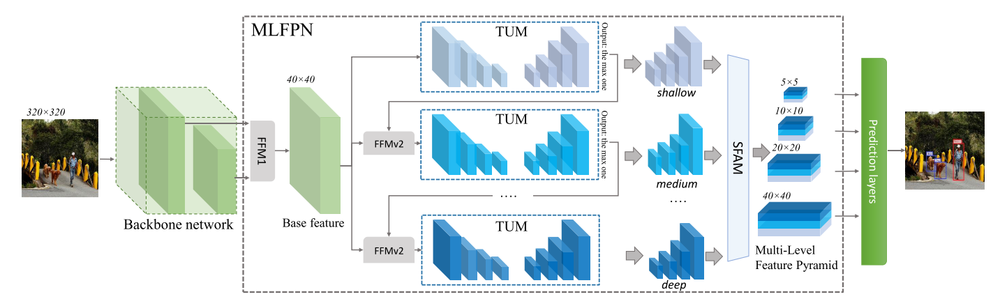

# RCNN
## Step1:Region Proposal
论文中说有很多region proposal的方法，本文无法从原理上证明哪些更好，为了方便和其他方法比较，就直接选择selective search(ss)。ss流程本文并没有再展开介绍。

此步骤不需要训练。

## Feature extraction
有了一堆**类别无关**的region proposal框，下一步就要对这些框框中的内容进行特征提取。本文使用AlexNet进行特征的抽取：将图片resize到227*227大小，送入AlexNet（5个卷积层和2个全连接层），得到一个4096维的特征向量。

**注:**resize的时候，

**此步骤需要对backbone网络进行预训练**。
1. **先在ILSVRC2012上训练一个image-level的分类网络（官方是用的CNN的caffe开源代码）**。这一步比较简单，没什么可说的。据论文解释称，他们在ILSVRC2012上的训练效果和Krizhevsky等的效果相仿，在验证集上的top-1精度还要高2.2个百分点，这主要是因为他们简化了训练过程。
2. **再对预训练网络在检测数据集上做进一步的finetune**。在image-level的图片上训练的分类网络backbone直接拿来用在检测任务的特征提取上效果并不好，因为用在检测任务上网络接收的输入是一个warped（或者叫resized）ROI区域，虽然尺寸上没有差别，但是ROI中的图像区域或多或少都存在一些形变，数据分布发生了改变，因此需要进一步微调参数。**具体做法是：（以VOC为例）**1) 将原分类网络的分类层由1000类输出调整为21类（20+1，VOC有20类，另外一类是background类）；2) 挑选合适的ROI作为训练样本：结合groundtruth，将selective search的得到的所有region proposals进行正负样本的分类。对每一个region的bounding box，寻找与它重叠度最大的groundtruth，如果它与groundtruth的bounding box之间IOU大于阈值0.5则赋予其groundtruth的类别标签，否则赋予类别标签为background。

## 检测框的分类与回归
### 训练阶段
### 测试阶段

# M2Det
## Proposed Method

## 多层次特征金字塔(Multi-level Feature Pyramid Network)
该模块的**输入**是卷积神经网络不同层的feature map（例如VGG的conv4_3和conv5_3）。

**首先**，FFMv1将输入feature map的深层和浅层特征进行融合，得到**base feature**；
**FFMv1**，FFMv1的输入是形状为(1024,20,20)和(512,40,40)的两个feature map，经过处理(各自经过卷积，然后前者做一个上采样)concat在一起，形成(768,40,40)形状的feature map，即为**base feature**.

**然后**，**base feature**被送入**多个**堆叠的<TUM, FFMv2>模块当中，其中TUM是个U型网络，上采样部分的feature map可以认为是多层不同尺度的feature map；FFMv2的作用是**将TUM最后一层feature map和base feature进行融合**，输出的结果送入下一个<TUM, FFMv2>模块中

